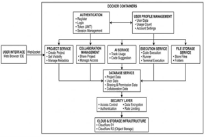
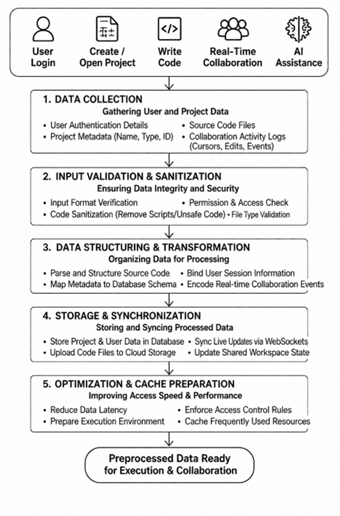
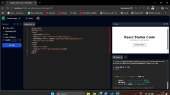

# 🚀 Serverless Cloud IDE with Real-Time Collaboration

<div align="center">

### ⚡ Code Anywhere. Collaborate Instantly. Scale Effortlessly.


</div>

---

## ✨ Overview

A **next-generation cloud-based IDE** that enables developers to **write, execute, and collaborate on code in real-time** — directly from the browser.

No setup. No dependencies. Just code. ⚡

> Built with **serverless architecture + Docker isolation + real-time sync**, making it scalable, secure, and collaboration-friendly.

---

## 🌟 Key Highlights

| Feature                         | Description                                       |
| ------------------------------- | ------------------------------------------------- |
| ⚡ **Zero Setup Development**    | Start coding instantly without local installation |
| 🤝 **Real-Time Collaboration**  | Multiple users editing simultaneously             |
| 🐳 **Docker Execution Engine**  | Secure sandboxed environments                     |
| 🤖 **AI Code Assistance**       | Smart suggestions & auto-completion               |
| ☁️ **Serverless Scalability**   | Auto-scales based on demand                       |
| 📂 **Cloud Storage (R2 + D1)**  | Persistent storage for files & data               |
| 🖥️ **Live Preview & Terminal** | Full IDE experience in browser                    |

---

## 🧠 Architecture

```text
User
 └── Frontend (Next.js)
      ├── WebSocket Server      → Real-time collaboration sync
      ├── Serverless APIs       → Business logic (Cloudflare Workers)
      ├── Docker Containers     → Isolated code execution
      ├── Cloudflare D1         → Database (via Drizzle ORM)
      └── Cloudflare R2         → File storage
```

---

## 🛠️ Tech Stack

| Category     | Technologies                 |
| ------------ | ---------------------------- |
| 🎨 Frontend  | Next.js, React, Tailwind CSS |
| ⚙️ Backend   | Node.js, WebSockets          |
| 🐳 Execution | Docker Containers            |
| ☁️ Cloud     | Cloudflare Workers, D1, R2   |
| 🤖 AI        | External AI APIs             |
| 🗄️ Database | Drizzle ORM + Cloudflare D1  |

---

## 📂 Project Structure

```
CodeXchange/
├── backend/
│   ├── server/
│   │   ├── dockerfile
│   │   ├── nodemon.json
│   │   ├── src/
│   │   │   ├── inactivity.ts
│   │   │   └── ratelimit.ts
│   │   └── package.json
│   ├── database/
│   │   ├── drizzle/
│   │   ├── drizzle.config.ts
│   │   ├── vitest.config.ts
│   │   └── wrangler.toml
│   └── storage/
│       ├── wrangler.toml
│       └── package.json
└── frontend/
    ├── app/
    │   ├── (app)/
    │   │   ├── code/page.tsx
    │   │   └── layout.tsx
    │   └── (auth)/
    │       ├── sign-in/
    │       └── sign-up/
    ├── components/
    │   ├── editor/
    │   │   ├── sidebar/
    │   │   └── live/room.tsx
    │   ├── ui/
    │   └── dashboard/
    ├── lib/
    │   ├── types.ts
    │   ├── ecs.ts
    │   └── colors.ts
    └── middleware.ts
```

---

## ⚙️ Installation

### 🔧 Prerequisites

* Node.js (v18+)
* Docker
* Cloudflare Wrangler CLI

---

### 🚀 Setup

```bash
git clone https://github.com/sairamesh-7/CodeXchange.git
cd CodeXchange
```

---

### 📦 Install Dependencies

```bash
# Frontend
cd frontend
npm install

# Backend
cd ../backend/server
npm install
```

---

### ▶️ Run Locally

```bash
# Backend
npm run dev

# Frontend (new terminal)
cd frontend
npm run dev
```

🌐 Open: **http://localhost:3000**

---

## 🔄 Workflow

```
1. 🔐 Login          → Clerk Authentication
2. 📁 Create Project → Choose language/template
3. ✍️ Write Code     → Browser editor
4. 🤝 Collaborate    → Real-time multi-user editing
5. 🤖 AI Suggestions → Smart completions
6. 🐳 Run Code       → Docker execution
7. ☁️ Save           → Cloudflare R2 storage
```

---

## 📸 Screenshots

> Add images inside `/ScreenShots` folder

| Architecture                      | Data Flow                       | Editor                        |
| --------------------------------- | ------------------------------- | ----------------------------- |
|  |  |  |

---

## ✅ What We Completed

* ✔ User authentication and session management
* ✔ Project creation and management
* ✔ Browser-based code editor
* ✔ Real-time collaboration (multi-user editing)
* ✔ Docker-based code execution
* ✔ Cloud storage integration
* ✔ Serverless backend

---

## 🚧 Future Improvements

* 🔄 GitHub Integration
* 🌐 Multi-language Support
* ⚡ Performance Optimization
* 🧪 Built-in Testing Pipelines
* 🧠 Advanced AI Integration
* 📊 Better Autoscaling

---

## 👨‍💻 Author

**Pragada Sai Ramesh**
🎓 SRM Institute of Science and Technology

---

## 📜 License

MIT License © 2026 sairamesh-7

---

<div align="center">

🌍 Built for Developers, by Developers
⭐ Star this repo if you like it!

</div>
